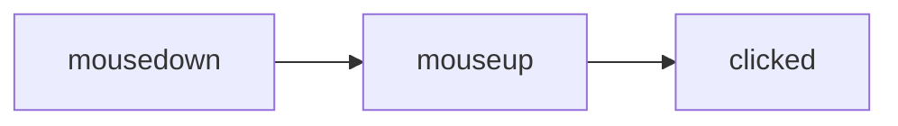
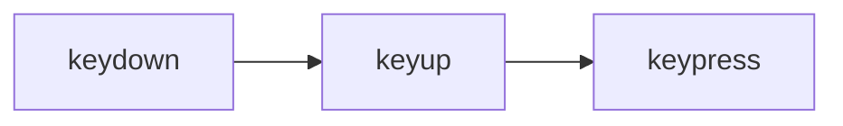

## 5 javascriptEvent

* javascript中的事件一般命名为click,submit,mouseover,mouseup,mousedown
* 而事件处理器一般会在事件前以on为前缀如onclick,onsubmit

### 5.1 事件的调用

#### 5.1.1 标签内绑定


``` html
    <input name="save" type="button" value="保存" onclick="clickFunction();alert()"> </input> <!--多个函数调用可以用分号分隔-->
    <script language="javascript">
        function clickFunction(){ //自定义函数
            alert("单击了保存按钮")
        }
    </script>
```

#### 5.1.2 动态绑定式

``` html
    <input id="save" name="save" type="button" value="保存">
    <script language="javascript">
        var b_save=document.getElementById("save")// 通过id来获取对象 也可以直接通过b_save.onclick=...来绑定
        b_save.onclick=function() {    //匿名类还可以通过箭头表达式来定义
            alert("单击了保存按钮")    //() =>{}
        }
    </script>
```

#### 5.1.3 事件监听

* 原型

``` javascript
    object.addEventListener('事件名',回调函数[,类型]) //类型为True or False 用来控制事件的“捕获”与“冒泡”
```

* 用例

```html
    <button id="btn"></button>
    <script>
        var btn=document.getElementById('btn');
        btn.addEventListener('click',clickFunction());

        function clickFunction(){ //自定义函数
            alert("单击了保存按钮")
        } 
    </script>
```

##### 5.1.3.1 事件的捕获与冒泡


* 冒泡：当标签有嵌套关系的时候事件的执行 从内到外

```javascript
    object.addEventListener('事件名',回调函数,true)
```

* 捕获：当标签有嵌套关系时事件的执行 从外到内

```javascript
    object.addEventListener('事件名',回调函数,true)
```

* 用例

```html
    <div id="red">
        <div id="green">
            <div id="blue"></div>
        </div> 
    </div>
    <script>
        var red = document.getElementById('red'); // 冒泡   事件出发顺序依次为 red -> green -> blue
        var green = document.getElementById('green');
        var blue = document.getElementById('blue'); 
        red.addEventListener('click',()=>{
            console.log('green');
        },true)
        blue.addEventListener('click',()=>{ 
            console.log('blue');
        },true)
        blue.addEventListener('click',()=>{
            console.log('blue');          },true) 

        var red = document.getElementById('red');// 捕获   事件出发顺序依次为 blue -> green -> red
        var green = document.getElementById('green');
        var blue = document.getElementById('blue');
        red.addEventListener('click',()=>{ 
            console.log('green');
        },false)
        blue.addEventListener('click',()=>{
            console.log('blue'); 
        },false)
        blue.addEventListener('click',()=>{
            console.log('blue');
        },false) 

    </script>
```

* 防止事件捕获与冒泡
    * 事件对象是window对象的一个属性  当有事件发生的时候 所有事件都会被存如事件对象中
        * ie: window.event
        * 标准浏览器: f(e) //e可以是任意名称
        ```html
            <div id="box">我是块元素</div>
            <p id="p0">我是段落</p>
            <button id="btn">我是按钮</button>
            
            <script>
                function f(p){
                    var tag = window.event.srcElement || p.target; //当window对象不存在的时候 使用 p
                    consoe.log("事件名称" + tag.tagName)
                }
        
                window.onclick = f;
            </script>
        ```

    * 还可以通过cancelBubble()/stoPropagation()来停止冒泡. ie 用cancelBubble() chrome用stoPropagation

### 5.2 鼠标键盘事件

#### 5.2.1 鼠标单击事件
* 鼠标的单击事件（click）是在鼠标单击是被出发，按下鼠标后在没有移动鼠标的同时放开鼠标
```html
    <input id="Submit" value="toBeChanged">test</button>
    <script>
        var change=document.getElementById("Submit");
        change.addEventListener('click',()=>{
            change.value="Changed"
        })
    </script>
```
#### 5.2.2 鼠标按下和松开
* 鼠标按下(mousdown)是指鼠标按下还未拿起的时候
* 鼠标松开(mouseup)是指鼠标按下后到松开的时候

> 鼠标单击事件的整个流程



#### 5.2.3 鼠标移入移出事件
* 移入onmouseover()
* 移出onmouseout()
#### 5.2.4 鼠标移动事件(mousemove()) 可用来获取鼠标的座标
```html
    <script>
        var x=0,y=0;
        function MousePlace(e){
            var event = window.event || e
                x=event.clientx;
                y=event.clienty;
                console.log("x="+x+"y="+y);
        }
        document.onmousemove=MousePlace;
    </script>
```

#### 5.2.5 键盘事件
* onkeypress()
* onkeydown()
* onkeyup()
```html
    <script>
        function f(e){
            var event = window.event || e
            if(event.keycode==65)
                location.reload()
        }
            
        window.onkeydown=f;
    </script>
```
> 键盘单击事件的整个流程


